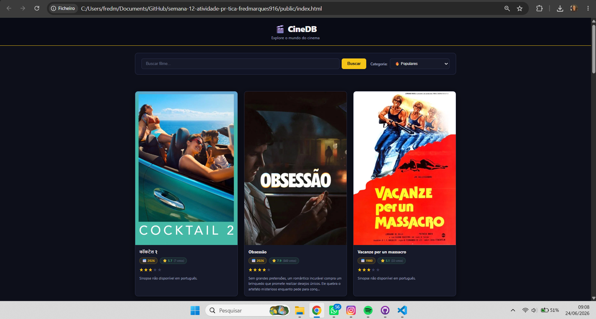
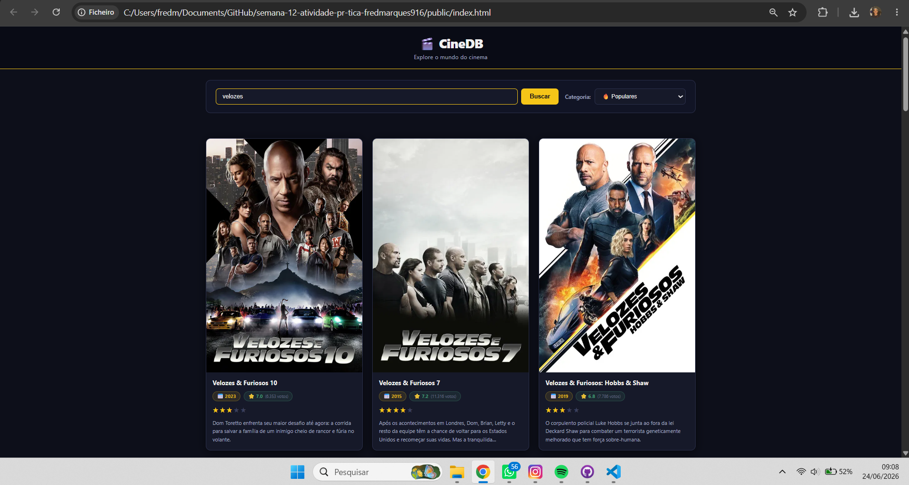

# Trabalho Prático - Semana 12

Nesta atividade, vamos trabalhar com uma API de mercado para montar uma interface de visualização de filmes. Para isso, vamos utilizar a [The Movie DB API](https://developer.themoviedb.org/docs/getting-started). A página resultante deve listar os resultados de uma requisição HTTP no formato de cards e deve incluir uma funcionalidade de pesquisa ou filtro. 

## Informações Gerais

- Nome: Frederico Marcos de Paula Marques
- Matricula: 907680

## Endpoint Utilizado
- **Listagem inicial:** `GET /movie/popular` — Filmes populares
- **Pesquisa por nome:** `GET /search/movie?query=...` — Busca por título
- **Filtros adicionais:** `top_rated`, `now_playing`, `upcoming`

## Prints do trabalho

## Fluxo da Aplicação
 
### Requisição → Tratamento → Renderização
 
1. **Requisição** — Ao carregar a página (ou ao interagir com busca/filtro), a função `fetchMovies()` monta a URL da API do TMDB com `api_key`, `language=pt-BR` e os parâmetros de busca/categoria, e executa `fetch(url)` de forma assíncrona com `async/await`.
2. **Tratamento** — A resposta HTTP é verificada com `response.ok`. Se bem-sucedida, é convertida para objeto JavaScript com `.json()`. O array `data.results` (lista de filmes) é retornado. Em caso de erro, uma mensagem é exibida ao usuário e um array vazio é retornado para evitar quebra da aplicação.
3. **Renderização** — A função `renderMovies()` limpa o container `#movie-list` e itera sobre os filmes, chamando `createMovieCard()` para cada um. Cada card é construído com `createElement`, `classList.add` e `appendChild`, exibindo poster, título, ano de lançamento, nota média com estrelas e a sinopse.